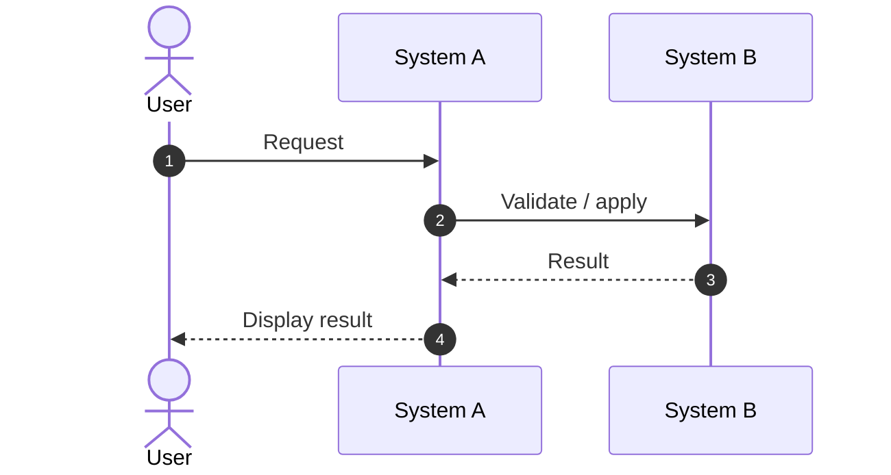

# {Feature / Backlog Name}

## Why

{3–5 short paragraphs explaining the problem, why it matters, what changes, and any important boundary.}

## User & Trigger

* **{User role}** — {trigger / need}.
* **{User role}** — {trigger / need}.

## Terminology

{Use bullets for short pages. Use the Terminology table only if terms need side-by-side scanning.}

## System Design

### {Responsibility split / Architecture boundary / State model / Data flow}

{Only include the design detail needed to make scenarios and acceptance criteria unambiguous.}

## In Scope / Out of Scope

### In Scope

* {Scope item}

### Out of Scope

* {Boundary item}

## Diagrams

{Conditional. Include sequence/state/flow diagrams only when they reduce ambiguity.}

## Scenarios

### Scenario 1 — {Scenario name}

**Summary:** {One short paragraph.}

**Preconditions:** {Optional.}

**Expected result:**

* {Expected behavior}
* {Expected behavior}

## Story Breakdown

### Story 1 — {Short capability name}

**Scenario:** {One sentence describing the user's observable outcome.}

**Spec / Acceptance Criteria:**

* {Concrete, testable criterion.}
* {Concrete, testable criterion.}
* {Concrete, testable criterion including edge/error state if relevant.}

## Design Considerations

1. **{Topic}** — {Tradeoff, constraint, or implementation-readiness issue.}

## Key Decisions

{Conditional. Use the canonical Key Decisions table width spec.}

## Impacted Domains / Dependency Assumptions

{Use the canonical Impacted Domains / Dependency Assumptions table width spec.}

## Definition of Done

* {Epic-level observable outcome.}
* {Cross-domain boundary/dependency expectation.}

## Open Questions / Risks

{Use the canonical Open Questions / Risks table width spec when any item exists.}

## Required Follow-up Actions

{Use the canonical Follow-up Actions table width spec when any item exists.}

## Revision

{Use the canonical Revision table width spec.}
